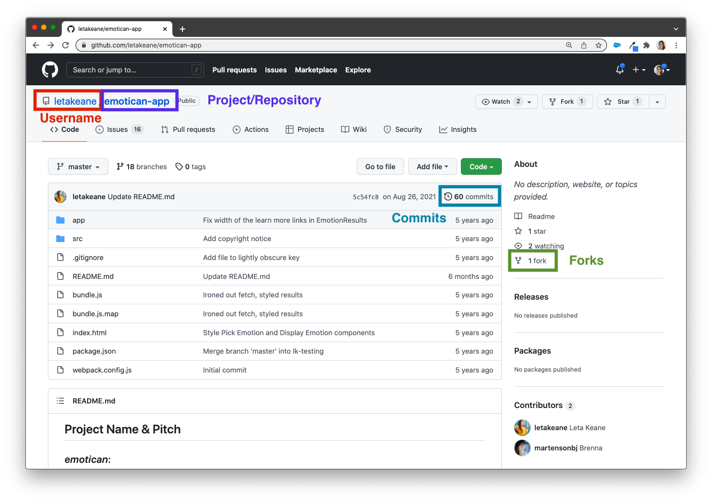
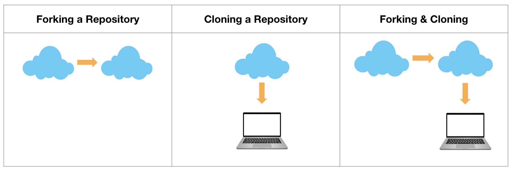

GitHub is a cloud-based Git repository where developers can store and manage their code. Up until this point, we've been tracking changes on our local machines using Git. This is a great start, but what if you accidentally spill water all over your machine? All of that progress would be lost... unless you stored a copy of it somewhere else. That's where GitHub can support our work!

## Learning Goals

- Identify the key information on a GitHub repository
- Create repositories in GitHub
- Connect a local repository to a remote repository
- Push work from a local repository to a remote repository
- Fork and clone GitHub repositories
- Describe the difference between forking and cloning a repository

## Vocabulary

- <span class="vocab">repository</span>
- <span class="vocab">local</span>
- <span class="vocab">remote</span>
- <span class="vocab">push</span>
- <span class="vocab">fork</span>
- <span class="vocab">clone</span>

## Warm-Up

Before we dive into creating GitHub repositories, let's take a moment to get comfortable looking at the key information provided to us on a GitHub repository. Open up <a href="https://github.com/letakeane/emotican-app" target="_blank">this GitHub repository</a> to identify some key pieces of information.



<div class="s-card">
  <h3>Key Information on a GitHub Repository</h3>
  <p><a href="https://github.com/ameseee/cover" target="blank">Visit this repository</a> and answer the following:</p>
  <ul>
    <li>What is the name of this project/repository?</li>
    <li>Who is the user that created and owns this repository?</li>
    <li>How many commits are on this repo?</li>
    <li>When was the last commit made?</li>
    <li>Find 2 commit messages that do not follow conventions - write them down, and write down a better commit message to replace each.</li>
    <li>How many times has this repository been forked?</li>
  </ul>
</div>
<br>

## Connecting a Local and Remote Repository

There are many ways to create and connect <span class="vocab">local</span> (on your machine) and <span class="vocab">remote</span> (in the cloud) repositories. We can't go through every combination of ways to do that, so we will focus on one. Once you are comfortable with this way, if you find another way to achieve the same outcome, you can absolutely use that.

1. Create a directory called `github_practice` and add a file in that directory with the title of your program: `ruby.md` or `javascript.md`.
1. Initialize a Git repository in your `github_practice` repository.
1. Add your file and commit your work.
1. Create a GitHub repository (do NOT check the box to create a README).
1. **Before completing the next steps, make sure that you have the `SSH` button selected at the top.** Then, follow the directions under `...or push an existing repository from the command line`, by running the following commands:
  - `git remote add origin git@github.com:USERNAME/REPO_NAME.git` This command tells the local repository to set the remote repository to this address. We refer to it as the `origin`.
  - _`git branch -M main` You do not need to do this if you have already configured Git to name the default branch `main`._
  - `git push -u origin main` This sends the current version of the project up to the remote repository, and sets the `main` branch as the default branch to send work up to.
1. Refresh your GitHub browser tab. You should now see your repository!

<br>
What follows is a diagram that breaks down the anatomy of the `git push -u origin main` command:


<div class="s-card">
  <h3>Practice</h3>
  <p>Follow the steps listed above to connect a local Git repository with a GitHub repository.</p>
</div>
<br>

## Git & GitHub Workflow

Now that we have our local repository connected to a remote repository, we can see our files along with any commits that we've made on GitHub. This means we can continue to work on our local machine, adding and committing our work as necessary. Then, when we push to GitHub, a record of those new changes will also be added to our remote repository! After making 1 or more commits on a local repository, we can push our work up using the following command:

```bash
git push origin main
```

Since we used the `-u` in our original push to connect the two repos, we already established main as the upstream branch. This means we can use the following command to get the exact same outcome:

```bash
git push
```

After running this command, Git will send your work up to GitHub (you must be connected to the internet), and you'll get many lines of output, finally telling you the work was successfully sent up. Refresh your GitHub browser tab, and the changes will be available there. <span class="vocab">Pushing</span> work up to a repository is the act of using Git commands to send the current version of a local repository up to the remote repository.

>For the extent of our work with Git and GitHub workflows _during Mod 0_, you will primarily be pushing work up. It is definitely possible to also pull down changes from a remote repository to your local repository, but you will only need to do this if you make changes in the remote repository by mistake. Please remember to always make edits to files on your local machine and then push them up! This will avoid any merge conflicts.

Altogether, the process of connecting a local repository to our remote repository and then using GitHub to store those changes looks something like this: 

1. Create a local directory with files.
1. Initialize a Git repository. Then, add and commit your work.
1. Connect your local repository to a remote repository on GitHub.
1. Make changes to your files. Add and commit your work.
1. Push those changes to GitHub. Refresh the browser to see those changes appear.
1. Make some more changes to your local files. Add and commit your work.
1. Push the new changes to GitHub.

<br>
<div class="s-card">
  <h3>Breakout Practice</h3>
  <p>In your previous repository, make two rounds of changes in the file you created, adding and committing those changes each time. When you're finished, push those changes to GitHub.</p> 
  <p><em>Note: All of these changes should be made in VS Code, not directly in GitHub!</em></p>
</div>
<br>

## Practice

Complete the following exercise to get practice and demonstrate your ability to use Git and GitHub.

<div class="s-card">
  <h3>Git & GitHub Workflow</h3>
  <p>Follow the steps below to practice connecting a local repository to a remote repository.</p>
  <ul>
    <li>Create a local repository.</li>
    <li>Create a GitHub repository.</li>
    <li>Connect the two repositories.</li>
    <li>Make a few changes and commits.</li>
    <li>Push up your changes.</li>
    <li>Make a few more changes and commits.</li>
    <li>Push up your new changes.</li>
    <li>View the commit history in the GitHub interface.</li>
  </ul>
  <p>When this work time is over, be prepared to screenshare to show your Terminal and/or GitHub and talk through your process, challenges, and questions you have.</p>
</div>
<br>

## Forking and Cloning Repositories

Often, you won't be creating a project from scratch. What if you want to create a copy of an already-existing GitHub repository and work from that repository? We can <span class="vocab">fork</span> a GitHub repository to make a copy of it on our own GitHub account. Or what if the company you're working for already has an application and you need to make changes to it? We can <span class="vocab">clone</span> a GitHub repository to our local machine, so that we can continue making changes from that already existing repository.

The diagram below visually shows the difference between forking and cloning a repository. In some cases, you may want to both fork and clone a repository. Forking allows you to create your own copy of a remote repository on your GitHub account and then cloning lets you edit and push changes up to your copy of the original repository.
<br>
<br>


Note that a few steps are a little different when you are cloning down a repository. You don't need to create an empty directory on your local machine when you clone down a repository. You also don't need to initialize git with `git init` if you cloned down the repository.

<br><br><br><br><br>
